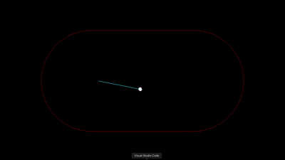

# Bunimovich Stadium Simulation

## Overview

The **Bunimovich Stadium** is a mathematical billiard table, a dynamical system used in chaos theory and statistical mechanics. It consists of a rectangular region with semicircular ends. The system exhibits chaotic dynamics, where the trajectories of balls inside the stadium are highly sensitive to their initial conditions.

This project models the **Bunimovich Stadium** using a 2D simulation, where balls move within the stadium and reflect off the boundaries according to the laws of elastic collisions.

## Features

- **Billiard Simulation**: Balls move inside the stadium and reflect off the boundaries. The reflections follow the laws of elastic collisions, maintaining the velocity magnitude but altering the direction based on the angle of incidence.
- **Chaotic Dynamics**: Due to the shape of the stadium, the system exhibits chaotic behavior, with the trajectory of each ball being sensitive to its initial conditions.
- **Real-time Updates**: Balls move in real time, with their positions updated according to the time step provided by the simulation.
- **Collision Detection**: The simulation checks for collisions between balls and the boundary, ensuring they reflect correctly without passing through the walls.

## Requirements

To run this simulation, you do not need to download any libraries since they are included in the env:

## Getting started
git clone https://github.com/yourusername/bunimovich-stadium.git

## Demo

